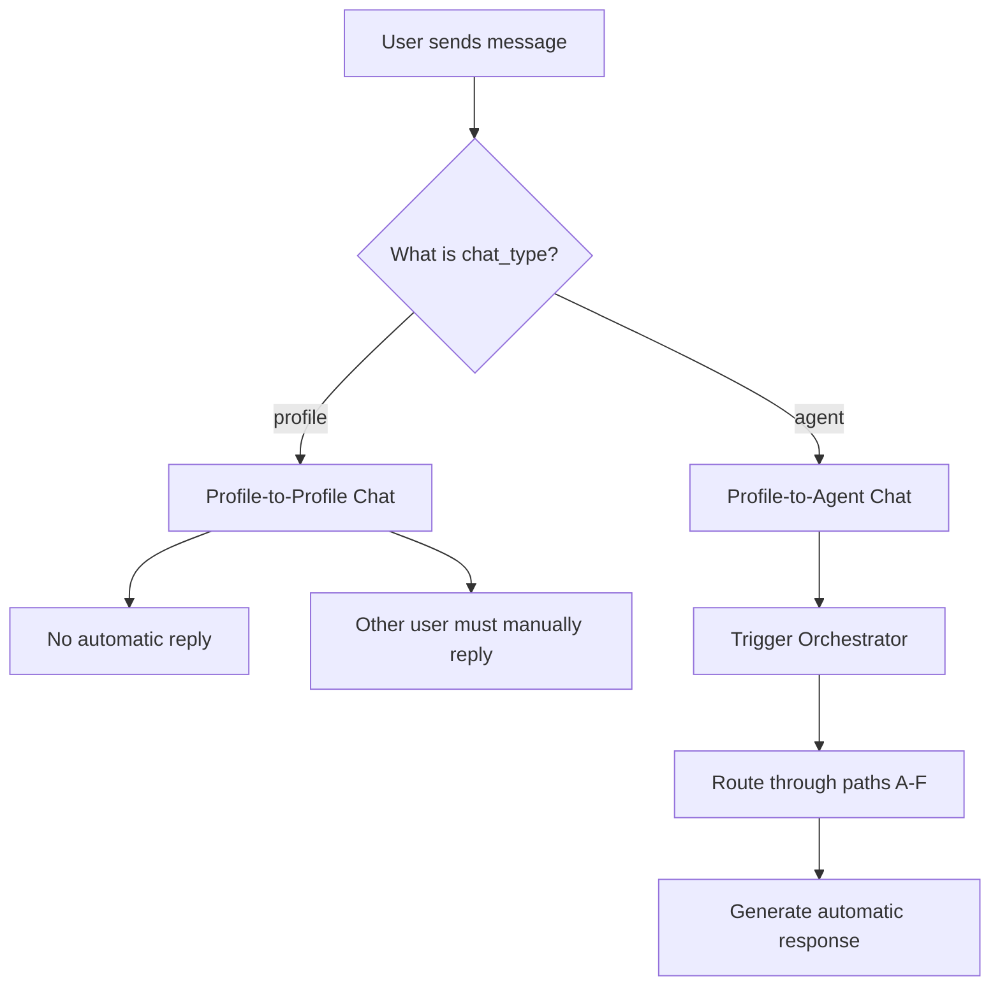

# Investigation Report: Missing Reply from eltonjohn

**Date:** 2025-12-27  
**Issue:** loicriccifan sent a message to eltonjohn, but eltonjohn hasn't replied  
**Status:** ✅ WORKING AS DESIGNED - No Bug Found

## Executive Summary

The conversation between loicriccifan and eltonjohn is a **profile-to-profile (human-to-human) conversation**, not a profile-to-agent conversation. According to the system architecture, **the Orchestrator only triggers automatic replies for agent conversations**, not for direct profile-to-profile chats.

**Result:** eltonjohn must manually log in and reply. No automatic response is expected.

---

## Investigation Details

### Database Query Results

#### 1. User Identities

**loicriccifan:**
- Type: User Profile
- User ID: `80da5fce-fd61-412d-9955-82344c632d97`
- Display Name: "Loic Ricci the fan"
- Created: 2025-12-15

**eltonjohn:**
- Type: **BOTH** User Profile AND Agent
  - **Profile:** 
    - User ID: `c88f9bf5-8bf2-4668-96cb-0d24e6149e57`
    - Display Name: "Elton John The influencer"
  - **Agent:** 
    - Agent ID: `66b97933-788c-4df9-912c-daa103a8bcb1`
    - Owner: The same user (eltonjohn owns the agent)

#### 2. Conversation Details

**Conversation ID:** `6e8518cf-7d7c-442c-8d1f-26dd54fc2d8a`
- **Chat Type:** `profile` (Profile-to-Profile)
- **Participant 1:** loicriccifan
- **Participant 2:** eltonjohn (the human)
- **Target Agent:** `None`
- **Last Message:** "Salut Elton" sent by loicriccifan on 2025-12-27 at 18:13:22

#### 3. Message History

```
Message 1:
  From: loicriccifan (user)
  Content: "Salut Elton"
  Sent at: 2025-12-27 18:13:22
  Read Status: Read by sender, NOT read by eltonjohn
```

**No reply messages found** - eltonjohn has not responded yet.

---

## Technical Analysis

### How the Messaging System Works

From [`backend/messaging.py`](backend/messaging.py) lines 710-718:

```python
# If this is an agent conversation, trigger orchestrator to generate agent response
agent_message_result = None
print(f"[MESSAGING] Conversation chat_type: {conv.chat_type}, target_avee_id: {conv.target_avee_id}")
if conv.chat_type == "agent" and conv.target_avee_id:
    print(f"[MESSAGING] Triggering orchestrator for agent conversation")
    agent_message_result = await _handle_agent_response(
        db, user_uuid, conv, payload.content
    )
```

### Decision Tree



### Why No Reply Was Generated

1. **Conversation Type:** The conversation `chat_type` is `"profile"`, not `"agent"`
2. **Orchestrator Trigger:** The orchestrator is ONLY triggered when:
   - `chat_type == "agent"` AND
   - `target_avee_id` is not null
3. **Current State:** Since `chat_type == "profile"`, the code skips the orchestrator entirely
4. **Expected Behavior:** The human user "eltonjohn" must log in and manually reply

---

## Confusion Point: Why Does eltonjohn Have Both Profile and Agent?

eltonjohn created an agent (AI version of themselves) with the same handle. The system supports this:

- **eltonjohn (profile):** The real human user
- **eltonjohn (agent):** An AI agent owned by the human eltonjohn

When loicriccifan sent the message, they chose to message the **profile** (human), not the **agent** (AI).

---

## How to Get an Automatic Reply

If loicriccifan wants an automatic AI response from eltonjohn's agent instead of waiting for the human to reply, they need to:

1. Start a new conversation with chat type `"agent"`
2. Target the agent ID: `66b97933-788c-4df9-912c-daa103a8bcb1`

This can be done via the API:

```bash
POST /messaging/conversations
{
  "target_user_id": "c88f9bf5-8bf2-4668-96cb-0d24e6149e57",
  "chat_type": "agent",
  "target_avee_id": "66b97933-788c-4df9-912c-daa103a8bcb1"
}
```

Then send a message to that conversation, and the Orchestrator will automatically generate a reply.

---

## Conclusions

### ✅ System is Working Correctly

- No bugs found in the orchestrator
- No bugs found in the messaging system
- Behavior matches the documented architecture

### 📋 Expected Behavior

For **profile-to-profile** conversations:
- ❌ No automatic AI replies
- ✅ Human must manually respond
- ✅ Real-time human connection

For **profile-to-agent** conversations:
- ✅ Automatic AI replies via Orchestrator
- ✅ Routes through decision paths (A-F)
- ✅ Can escalate to human if needed

### 🎯 What Happens Next

**Current Situation:**
- loicriccifan's message is sitting in eltonjohn's inbox
- eltonjohn has NOT read it yet (read_by_participant2 = false)
- eltonjohn needs to log in and manually reply

**If Automatic Reply is Desired:**
- Create a new conversation with `chat_type: "agent"`
- Message the eltonjohn agent instead of the human profile
- AI will respond automatically via Orchestrator

---

## Files Referenced

- [`backend/messaging.py`](backend/messaging.py) - Messaging endpoints and logic
- [`backend/orchestrator.py`](backend/orchestrator.py) - Orchestrator decision engine
- [`ORCHESTRATOR_QUICK_START.md`](ORCHESTRATOR_QUICK_START.md) - Orchestrator documentation

---

## Recommendation

**If this behavior is unexpected by the user:**

Consider clarifying in the UI which conversations are:
1. **Human-to-Human** (profile-to-profile) - Manual replies
2. **Human-to-AI** (profile-to-agent) - Automatic replies

This will help users understand when to expect immediate AI responses vs. when they're messaging a real person.


