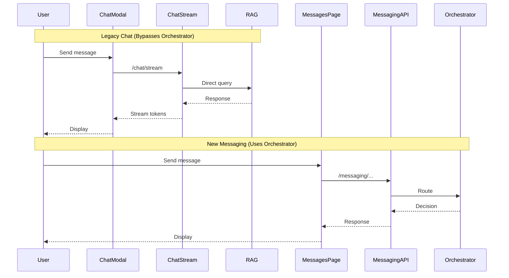
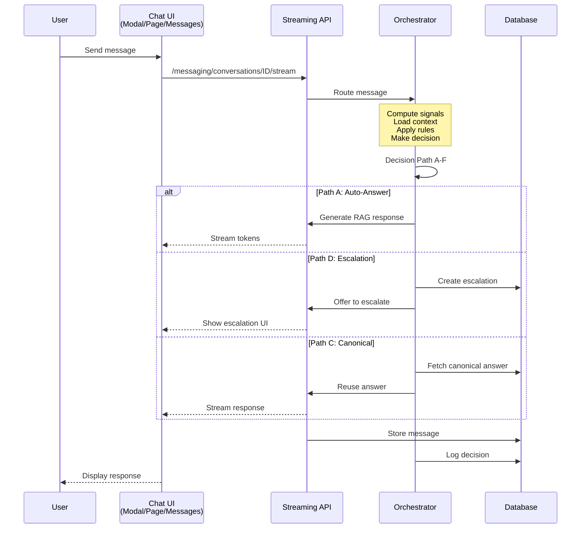
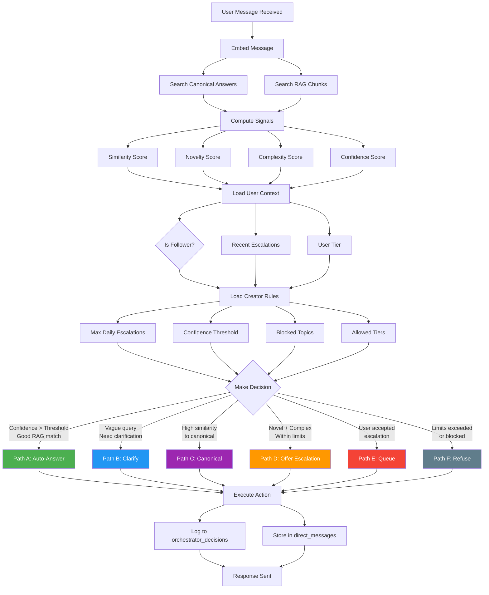
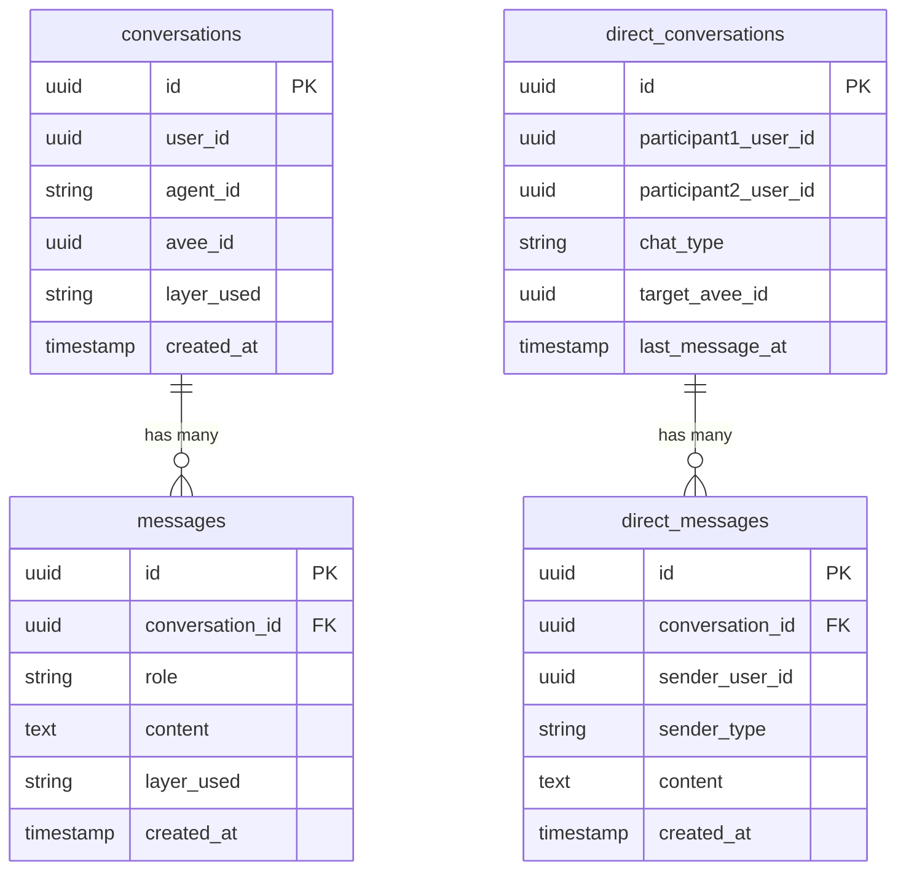
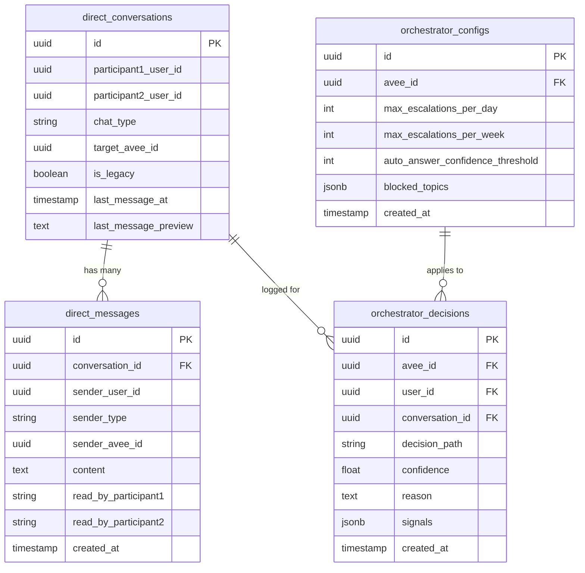
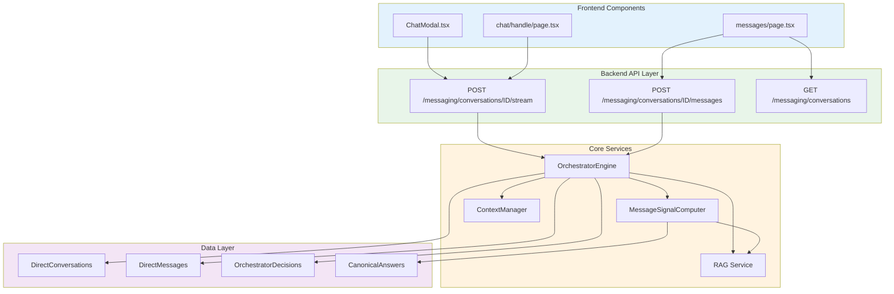

# Unified Chat Architecture - Visual Guide

## 📐 Architecture Transformation

This document visualizes the architectural changes made to achieve a coherent, unified chat system.

---

## Before: Incoherent Architecture ❌

### The Problem

```mermaid
graph TB
    User[User sends message to agent]
    
    subgraph LegacyChat [Legacy Chat System - BYPASSED ORCHESTRATOR]
        ChatModal[ChatModal popup]
        ChatPage[/chat/handle page]
        ChatStream["/chat/stream"]
        DirectRAG[Direct RAG + GPT]
        ConvDB[conversations table]
        
        ChatModal --> ChatStream
        ChatPage --> ChatStream
        ChatStream --> DirectRAG
        DirectRAG --> ConvDB
    end
    
    subgraph NewMessaging [New Messaging System - USED ORCHESTRATOR]
        MessagesPage[/messages page]
        MessagingAPI["/messaging/* API"]
        OrchestratorOld[Orchestrator]
        DirectConvDB[direct_conversations table]
        
        MessagesPage --> MessagingAPI
        MessagingAPI --> OrchestratorOld
        OrchestratorOld --> DirectConvDB
    end
    
    User -->|Option 1| LegacyChat
    User -->|Option 2| NewMessaging
    
    style LegacyChat fill:#ffebee,stroke:#c62828,stroke-width:3px
    style NewMessaging fill:#e8f5e9,stroke:#2e7d32,stroke-width:2px
```

### Problems
- ❌ Two separate systems with different behaviors
- ❌ Legacy chat bypassed Orchestrator completely
- ❌ Inconsistent user experience
- ❌ Creator configs ignored in chat modal
- ❌ Incomplete metrics and analytics
- ❌ Data fragmented across two databases

---

## After: Unified Architecture ✅

### The Solution

```mermaid
graph TB
    User[User sends message to agent]
    
    subgraph UnifiedFrontend [Unified Frontend - All Use Same API]
        ChatModal[ChatModal popup]
        ChatPage[/chat/handle page]
        MessagesPage[/messages page]
    end
    
    subgraph UnifiedBackend [Unified Backend API]
        StreamAPI["/messaging/conversations/ID/stream"]
        MessagesAPI["/messaging/conversations/ID/messages"]
    end
    
    subgraph OrchestratorEngine [Orchestrator Decision Engine]
        RouteMessage[Route Message]
        ComputeSignals[Compute Signals]
        LoadContext[Load User Context]
        LoadRules[Load Creator Rules]
        
        Decision{Decision Path}
        PathA[Path A: Auto-Answer<br/>High confidence RAG]
        PathB[Path B: Clarify<br/>Ask questions]
        PathC[Path C: Canonical<br/>Reuse existing answer]
        PathD[Path D: Escalate<br/>Offer to creator]
        PathE[Path E: Queue<br/>Wait for creator]
        PathF[Path F: Refuse<br/>Limits reached]
        
        RouteMessage --> ComputeSignals
        ComputeSignals --> LoadContext
        LoadContext --> LoadRules
        LoadRules --> Decision
        
        Decision -->|Conf > 75%| PathA
        Decision -->|Vague query| PathB
        Decision -->|Similar exists| PathC
        Decision -->|Novel + complex| PathD
        Decision -->|User accepted| PathE
        Decision -->|Limits hit| PathF
    end
    
    subgraph UnifiedDatabase [Unified Database]
        DirectConv[direct_conversations<br/>Single source of truth]
        DirectMsg[direct_messages<br/>All messages here]
        OrchestratorLog[orchestrator_decisions<br/>Complete analytics]
    end
    
    User --> UnifiedFrontend
    ChatModal --> StreamAPI
    ChatPage --> StreamAPI
    MessagesPage --> MessagesAPI
    
    StreamAPI --> OrchestratorEngine
    MessagesAPI --> OrchestratorEngine
    
    PathA --> DirectConv
    PathB --> DirectConv
    PathC --> DirectConv
    PathD --> DirectConv
    PathE --> DirectConv
    PathF --> DirectConv
    
    DirectConv --> DirectMsg
    OrchestratorEngine --> OrchestratorLog
    
    style UnifiedFrontend fill:#e3f2fd,stroke:#1976d2
    style UnifiedBackend fill:#e8f5e9,stroke:#2e7d32
    style OrchestratorEngine fill:#fff3e0,stroke:#f57c00
    style UnifiedDatabase fill:#f3e5f5,stroke:#7b1fa2
```

### Benefits
- ✅ Single unified system
- ✅ All agent interactions through Orchestrator
- ✅ Consistent intelligent routing everywhere
- ✅ Creator controls enforced universally
- ✅ Complete metrics and analytics
- ✅ Single source of truth for data

---

## Data Flow Comparison

### Before: Fragmented



### After: Unified



---

## Orchestrator Decision Flow



---

## Database Schema Evolution

### Before: Fragmented



**Problem**: Two separate conversation systems

### After: Unified



**Solution**: Single unified system with complete Orchestrator integration

---

## Component Integration



---

## Migration Path

```mermaid
graph LR
    subgraph Phase1 [Phase 1: Add Streaming]
        AddStream[Add /messaging/.../stream]
        RouteOrch[Route through Orchestrator]
        StreamResp[Stream responses]
    end
    
    subgraph Phase2 [Phase 2: Update Frontend]
        UpdateModal[Update ChatModal]
        UpdatePage[Update ChatPage]
        CreateDirect[Create DirectConversations]
    end
    
    subgraph Phase3 [Phase 3: Migrate Data]
        RunMigration[Run SQL migration]
        CopyConv[Copy conversations]
        CopyMsg[Copy messages]
        AddLegacy[Add is_legacy flag]
    end
    
    subgraph Phase4 [Phase 4: Deprecate]
        MarkDeprecated[Mark /chat/* deprecated]
        AddWarnings[Add console warnings]
        UpdateDocs[Update documentation]
    end
    
    Phase1 --> Phase2
    Phase2 --> Phase3
    Phase3 --> Phase4
    
    style Phase1 fill:#4caf50,color:#fff
    style Phase2 fill:#2196f3,color:#fff
    style Phase3 fill:#9c27b0,color:#fff
    style Phase4 fill:#ff9800,color:#fff
```



---

## Summary

### What Changed
- ✅ **Frontend**: All chat UIs now use unified messaging API
- ✅ **Backend**: Added streaming with Orchestrator integration
- ✅ **Database**: Migrated to single conversation system
- ✅ **Architecture**: Eliminated parallel systems, single path through Orchestrator

### Result
A **coherent, unified chat architecture** where:
- All agent interactions intelligently routed
- Creators have full control everywhere
- Users get consistent experience
- Complete metrics and observability
- Single maintainable codebase

---

**Status**: ✅ Complete  
**Version**: 1.0.0  
**Date**: December 27, 2025


