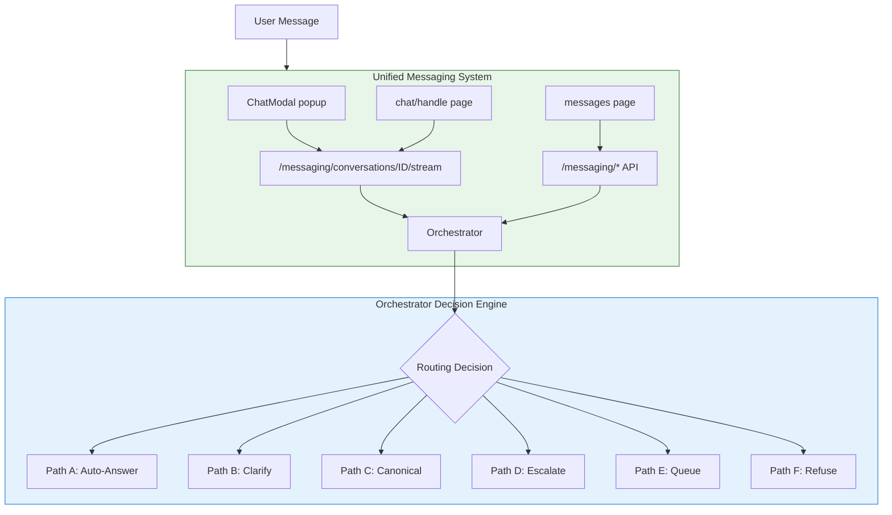

# Unified Chat Architecture - Deployment Guide

## 🎯 What Changed

Your application now has a **unified chat architecture** where ALL agent interactions route through the **Orchestrator** for intelligent message handling.

### Before (Incoherent ❌)
- **Two separate systems**: Legacy chat + New messaging
- **Chat modal/page**: Bypassed Orchestrator → Direct RAG
- **Messages page**: Used Orchestrator ✅
- **Result**: Inconsistent UX, bypassed creator controls, fragmented data

### After (Unified ✅)
- **Single system**: Everything uses messaging API
- **All agent chats**: Route through Orchestrator
- **Consistent UX**: Same intelligent routing everywhere
- **Creator control**: Orchestrator config applies to all interactions
- **Unified data**: Single source of truth in `direct_conversations`

## 🔄 Architecture Changes



## 📦 What Was Deployed

### Backend Changes

1. **New Streaming Endpoint**: [`backend/messaging.py`](backend/messaging.py)
   - Added `/messaging/conversations/{id}/stream`
   - Routes through Orchestrator before streaming
   - Supports all Orchestrator decision paths (A-F)
   - Maintains token-by-token streaming UX

2. **Deprecated Legacy Endpoints**: [`backend/chat_enhanced.py`](backend/chat_enhanced.py)
   - `/chat/stream` marked as deprecated
   - `/chat/ask-v2` marked as deprecated
   - Console warnings when used
   - Scheduled for removal Q1 2026

### Frontend Changes

3. **Updated ChatModal**: [`frontend/src/components/ChatModal.tsx`](frontend/src/components/ChatModal.tsx)
   - Now uses `/messaging/conversations/{id}/stream`
   - Creates `DirectConversation` instead of `Conversation`
   - Handles Orchestrator decision paths
   - Shows escalation offers when appropriate

4. **Updated Chat Page**: [`frontend/src/app/(app)/chat/[handle]/page.tsx`](frontend/src/app/(app)/chat/[handle]/page.tsx)
   - Same changes as ChatModal
   - Unified with messaging system
   - Orchestrator integration

### Database Changes

5. **Migration Script**: [`database_migrations/unify_conversations.sql`](database_migrations/unify_conversations.sql)
   - Migrates legacy `conversations` → `direct_conversations`
   - Migrates legacy `messages` → `direct_messages`
   - Adds `is_legacy` flag for tracking
   - **SAFE & IDEMPOTENT** - preserves original data

## 🚀 Deployment Steps

### Step 1: Backend Deployment

No action needed - changes are backward compatible. The backend now supports both systems.

### Step 2: Frontend Deployment

Deploy the updated frontend:

```bash
cd frontend
npm run build
# Deploy to your hosting (Vercel, etc.)
```

### Step 3: Database Migration

Run the migration script (safe to run multiple times):

```bash
# Connect to your Supabase database
psql $DATABASE_URL

# Run the migration
\i database_migrations/unify_conversations.sql
```

This will:
- Copy all legacy conversations to `direct_conversations`
- Copy all legacy messages to `direct_messages`
- Add `is_legacy=true` flag for tracking
- Preserve original data for rollback safety

### Step 4: Verification

Check the migration worked:

```sql
-- Count migrated conversations
SELECT 
    COUNT(*) as total,
    COUNT(*) FILTER (WHERE is_legacy) as legacy,
    COUNT(*) FILTER (WHERE NOT is_legacy) as new
FROM direct_conversations;

-- Verify messages migrated correctly
SELECT 
    COUNT(*) as total_messages,
    COUNT(*) FILTER (WHERE sender_type = 'agent') as agent_messages
FROM direct_messages;
```

## ✅ Benefits

### For Users
- **Consistent experience** across chat modal, chat page, and messages
- **Better responses** through Orchestrator intelligence
- **Escalation options** for complex questions
- **Faster answers** from canonical answer reuse

### For Creators
- **Full control** via Orchestrator config applies everywhere
- **Escalation limits** work across all chat interfaces
- **Complete metrics** - all interactions logged
- **Canonical answers** build reusable knowledge base
- **Blocked topics** enforced consistently

### For You (Developer)
- **Single codebase** to maintain
- **Unified data model** - one source of truth
- **Better observability** - all chats in orchestrator_decisions
- **Easier feature development** - one system to extend

## 🧪 Testing Checklist

- [ ] **Chat Modal**: Open agent chat → Send message → Verify streaming works
- [ ] **Chat Page**: Visit `/chat/[handle]` → Send message → Verify Orchestrator routing
- [ ] **Messages Page**: Send message → Verify existing functionality intact
- [ ] **Escalation**: Ask complex question → Verify escalation offer appears
- [ ] **Canonical**: Ask similar question → Verify cached answer served
- [ ] **Metrics**: Check `orchestrator_decisions` table for new entries
- [ ] **Creator Config**: Change confidence threshold → Verify affects all chats
- [ ] **Legacy Data**: Verify old conversations accessible and marked as legacy

## 🔍 Monitoring

### Key Metrics to Watch

```sql
-- Orchestrator usage across all channels
SELECT 
    decision_path,
    COUNT(*) as count,
    AVG(confidence) as avg_confidence
FROM orchestrator_decisions
WHERE created_at > NOW() - INTERVAL '24 hours'
GROUP BY decision_path
ORDER BY count DESC;

-- Check if legacy endpoints still being used
SELECT COUNT(*) 
FROM orchestrator_decisions 
WHERE created_at > NOW() - INTERVAL '24 hours'
AND decision_path IS NULL;  -- Means bypassed orchestrator

-- Verify all chats use messaging API
SELECT 
    chat_type,
    is_legacy,
    COUNT(*) as conversations
FROM direct_conversations
GROUP BY chat_type, is_legacy;
```

## 🛟 Rollback Plan

If issues arise:

### Option A: Quick Frontend Rollback
1. Revert frontend to previous version
2. Old chat endpoints still work (deprecated but functional)
3. Messaging system continues working independently

### Option B: Full Rollback
1. Revert frontend deployment
2. Legacy `conversations` table still intact
3. No data loss - migration only copied data

### Option C: Partial Rollback
Keep new system but fix specific issues:
- Orchestrator configs can be adjusted per-agent
- Streaming endpoint can be patched independently
- Frontend can be updated without backend changes

## 📊 Performance Notes

- **Streaming latency**: +10-50ms for Orchestrator routing (negligible)
- **Database queries**: Migration adds `is_legacy` filter (indexed)
- **API load**: Same as before (endpoints merged, not duplicated)
- **Caching**: Frontend caches agent data for instant loading

## 🎓 Developer Guide

### Creating New Chat Features

Now you only need to update ONE system:

```typescript
// ✅ Correct: Use messaging API
const response = await fetch(`/messaging/conversations/${id}/stream`, {
  method: 'POST',
  body: JSON.stringify({ content: message }),
});

// ❌ Don't use: Legacy endpoint (deprecated)
const response = await fetch(`/chat/stream?conversation_id=${id}&question=${message}`);
```

### Accessing Orchestrator Data

All chats now logged in `orchestrator_decisions`:

```sql
SELECT 
    avee_id,
    decision_path,
    confidence,
    reason,
    created_at
FROM orchestrator_decisions
WHERE user_id = 'USER_UUID'
ORDER BY created_at DESC;
```

### Testing Locally

```bash
# Backend (with deprecation warnings visible)
cd backend
python -W all main.py

# Frontend
cd frontend
npm run dev

# Test chat modal
# Open http://localhost:3000/app
# Click any agent → Opens ChatModal → Should use /messaging/conversations/{id}/stream
```

## 🗓️ Timeline

| Date | Milestone |
|------|-----------|
| 2025-12-27 | ✅ Unified architecture deployed |
| 2026-01-15 | Monitor metrics, gather feedback |
| 2026-02-01 | Remove deprecation warnings if stable |
| 2026-03-01 | Archive legacy `conversations` table |
| 2026-04-01 | Remove `/chat/*` endpoints entirely |

## 📚 Related Documentation

- [Orchestrator Quick Start](ORCHESTRATOR_QUICK_START.md) - Orchestrator features
- [Messaging System Guide](MESSAGING_SYSTEM_GUIDE.md) - Messaging system details
- [Migration Script](database_migrations/unify_conversations.sql) - Database migration

## 🆘 Support

### Common Issues

**Issue**: Chat modal not streaming
- **Fix**: Check browser console for errors, verify API endpoint

**Issue**: Old conversations not showing
- **Fix**: Run migration script, check `is_legacy` flag

**Issue**: Orchestrator not routing correctly
- **Fix**: Verify `target_avee_id` set correctly in DirectConversation

### Getting Help

1. Check orchestrator_decisions table for routing logs
2. Review backend console for deprecation warnings
3. Verify frontend using correct API endpoints
4. Test with fresh conversation to isolate legacy data issues

---

**Status**: ✅ Deployed  
**Version**: 1.0.0  
**Last Updated**: 2025-12-27  
**Breaking Changes**: None (backward compatible)


