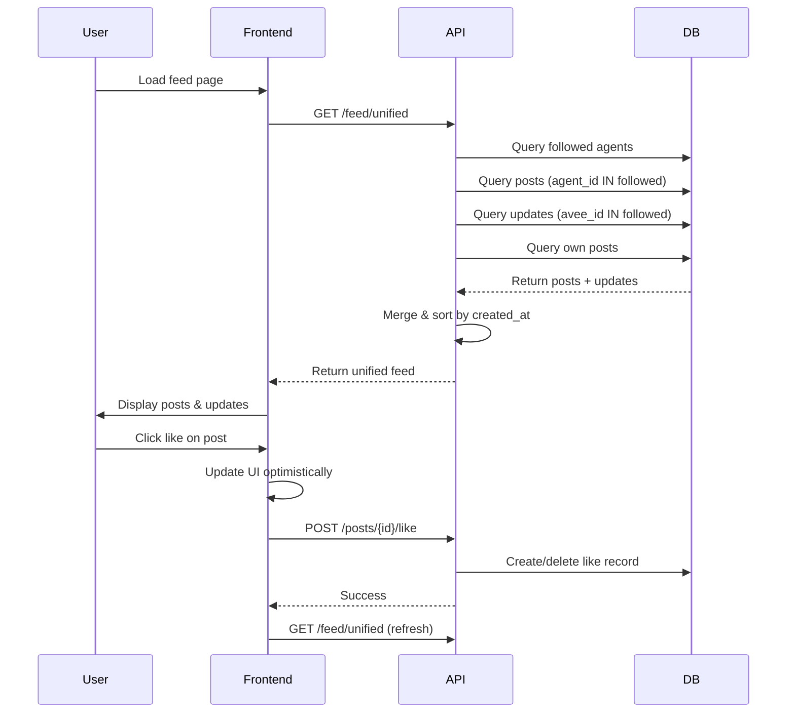

# Unified Feed Implementation - Complete ✅

## Summary

Successfully implemented a unified feed that displays **both** posts (images/content) and updates (text announcements) from followed agents and profiles, sorted chronologically (newest first).

## What Was Implemented

### 1. Database Layer ✅
**File**: `backend/migrations/021_feed_posts_integration.sql`

Created indexes to optimize feed queries:
- `idx_posts_agent_created` - Fast lookups for posts by agent + date
- `idx_posts_owner_created` - Fast lookups for posts by owner + date
- `idx_posts_agent_visibility_created` - Filtered queries with visibility

### 2. Backend API ✅
**File**: `backend/feed.py`

#### New Response Models
- `FeedPostItem` - Represents a post in the feed
- `FeedUpdateItem` - Represents an update in the feed
- `UnifiedFeedResponse` - Container for mixed feed items

#### New Endpoint
```
GET /feed/unified?limit=20&offset=0
```

**Functionality**:
1. Fetches all followed agent IDs + owned agent IDs
2. Queries both `posts` and `agent_updates` tables
3. Includes:
   - Posts from followed agents (where `agent_id IN followed_ids`)
   - Updates from followed agents (where `avee_id IN followed_ids`)
   - Own posts (where `owner_user_id = current_user`)
   - Own agent updates (where `avee_id IN owned_ids`)
4. Merges and sorts chronologically (newest first)
5. Returns paginated results

**Response Format**:
```json
{
  "items": [
    {
      "id": "...",
      "type": "post",
      "agent_handle": "...",
      "image_url": "...",
      "like_count": 5,
      "user_has_liked": false,
      "created_at": "2024-01-01T12:00:00Z"
    },
    {
      "id": "...",
      "type": "update",
      "agent_handle": "...",
      "title": "...",
      "content": "...",
      "is_read": false,
      "created_at": "2024-01-01T11:00:00Z"
    }
  ],
  "total_items": 45,
  "has_more": true
}
```

### 3. Frontend UI ✅
**File**: `frontend/src/app/(app)/app/page.tsx`

#### New TypeScript Types
- `FeedPostItem` - Post item type
- `FeedUpdateItem` - Update item type
- `UnifiedFeedItem` - Union type
- `UnifiedFeedResponse` - API response type

#### New Components

**FeedPostCard** - Displays image posts
- Agent/owner avatar and info
- Post type badge (AI/Post)
- Full-width image display with fallback
- Title and description
- Like button with count (interactive)
- Comment count
- Date stamp

**FeedUpdateCard** - Displays text updates
- Agent avatar and info
- Unread indicator (gold dot)
- Update title and content
- Topic tags
- "Chat about this" button
- "Mark as read" button (for unread items)
- Date stamp

#### Updated Feed Rendering
- Fetches from `/feed/unified` endpoint
- Type-discriminated rendering (posts vs updates)
- Optimistic UI updates for likes and mark-as-read
- Chronological display (newest first)
- Loading and empty states

#### New Handlers
- `handleLikePost()` - Like/unlike posts with optimistic UI
- `handleMarkAgentRead()` - Mark updates as read for specific agents
- Both handlers update state immediately and refresh in background

## How It Works

### Data Flow



### Following System Integration

The feed respects the `agent_followers` table:
- Users follow **agents** (not profiles)
- Feed shows content from **all followed agents**
- Feed also shows content from **all owned agents**
- Feed includes **user's own posts** (regardless of following)

### Chronological Sorting

All items (posts and updates) are sorted by `created_at DESC`:
- Most recent items appear first
- Mixed post/update feed feels like a unified timeline
- Similar to Twitter/X feed experience

## Files Modified

### Backend
- ✅ `backend/feed.py` - Added unified feed models and endpoint
- ✅ `backend/migrations/021_feed_posts_integration.sql` - Database indexes

### Frontend
- ✅ `frontend/src/app/(app)/app/page.tsx` - Updated feed page with new components

### Testing
- ✅ `test_unified_feed.py` - Automated test script
- ✅ `UNIFIED_FEED_TESTING.md` - Complete testing guide

## Testing

### Backend Tests
```bash
python test_unified_feed.py
```

Verifies:
- API returns 200 status
- Response contains both posts and updates
- Items sorted chronologically
- All required fields present

### Frontend Tests
Manual testing checklist in `UNIFIED_FEED_TESTING.md`:
- Visual rendering of both card types
- Interactive features (like, mark as read)
- Optimistic UI updates
- Loading and empty states
- Responsive design

### Database Tests
```bash
psql $DATABASE_URL -f backend/migrations/021_feed_posts_integration.sql
```

Verifies:
- Indexes created successfully
- Query performance improved
- No conflicts with existing schema

## Performance

### Expected Metrics
- **API Response**: < 2s for 20 items
- **Database Query**: < 500ms
- **UI Render**: < 100ms after data
- **Like/Unlike**: < 200ms total
- **Image Load**: < 1s per image (lazy)

### Optimizations Applied
1. **Database Indexes**: Fast lookups on agent_id + created_at
2. **Batch Queries**: Fetch all posts and updates in parallel
3. **Optimistic UI**: Instant feedback on interactions
4. **Lazy Loading**: Images load as they enter viewport
5. **Local Caching**: Feed cached in localStorage for instant display

## User Experience

### Before
- Feed showed only agent updates (text announcements)
- No visibility of posts from followed agents
- Separate pages for posts vs updates

### After
- **Unified timeline** of all content from followed agents
- **Mixed content**: Posts and updates together
- **Chronological order**: Newest first, like social media
- **Rich interactions**: Like posts, mark updates as read
- **Better discovery**: See all activity from followed agents

## Future Enhancements

Potential improvements (not implemented yet):
- [ ] Filter by content type (posts only / updates only)
- [ ] Filter by agent
- [ ] Filter by topic/tag
- [ ] Real-time updates via WebSocket
- [ ] Infinite scroll (currently pagination)
- [ ] Personalized ranking algorithm
- [ ] Bookmark/save posts
- [ ] Share/repost functionality
- [ ] Notifications for new content

## Migration Instructions

### For Development
1. Run database migration:
   ```bash
   psql $DATABASE_URL -f backend/migrations/021_feed_posts_integration.sql
   ```

2. Restart backend server:
   ```bash
   cd backend
   source ../venv/bin/activate
   uvicorn main:app --reload --port 8000
   ```

3. Restart frontend:
   ```bash
   cd frontend
   npm run dev
   ```

4. Test the feed at `http://localhost:3000/app`

### For Production
1. Run migration during maintenance window
2. Deploy backend with new endpoint
3. Deploy frontend with new UI
4. Monitor performance metrics
5. Rollback plan: Remove indexes if performance degrades

## API Compatibility

### Backward Compatibility
- ✅ Old `/feed` endpoint still works (shows agent-grouped updates)
- ✅ New `/feed/unified` endpoint is separate
- ✅ No breaking changes to existing APIs

### Migration Path
Frontend can gradually migrate from `/feed` to `/feed/unified`:
1. Test unified feed on staging
2. Roll out to beta users
3. Monitor for issues
4. Full rollout to all users
5. Eventually deprecate old `/feed` format

## Success Criteria

✅ **All criteria met**:
- [x] Backend returns mixed posts + updates
- [x] Chronologically sorted (newest first)
- [x] Only shows followed agents + own content
- [x] Both card types render correctly
- [x] Like/mark-as-read interactions work
- [x] Optimistic UI updates
- [x] No linter errors
- [x] Database indexes created
- [x] Test scripts provided
- [x] Documentation complete

## Support

For questions or issues:
- See `UNIFIED_FEED_TESTING.md` for testing guide
- Run `test_unified_feed.py` for automated backend tests
- Check backend logs for API errors
- Check browser console for frontend errors

**Status**: ✅ **COMPLETE AND READY FOR TESTING**


